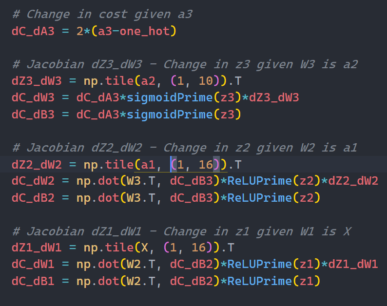

# Neural Network from Scratch
> Author: Kaleb Ugalde

The purpose of this project was to get a more complete understanding of the inner workings of neural networks. Using only numpy and the keras MNIST dataset, I was able to create a neural network that could predict the MNIST Handwritten numbers dataset with over 90% accuracy.

## Files
* load_data.py - Test to see how the data should be loaded
* MNIST_NN.py - Tried using torch to see if GPU ran faster. In the end numpy was faster
* numpy_MNIST.py - The numpy version of the model
* reference.py - The proof of concept for my project

## Results
With 100 epochs of training, approximately taking 20 mins of time in my system, I was able to train the neural network to about 95% accuracy.

## My Understanding

### Architecture
I chose to use three layers in my neural network where all the layers have a size 16. The first two layers utilize the ReLU activation function and the output layer utilizes a sigmoid activation function.

### Forward Calculation
The forward calculation is how the neural network infers the data it has been given. The basic functions of the neural network are the linear, ReLU, and sigmoid function. The linear function is the foundation on how neural networks work. The linear function works by multiplying an input vector x by a weight matrix W and adds a bias vector b to give an output vector z. Since the function is linear the only outputs it can give are linear. This doesn't generalize well to most real world problems and must be transformed by a nonlinear function. ReLU, Rectified Linear Unit, is one such nonlinear function where all negative values are set to zero and all positive values stay the same. The sigmoid function is another common nonlinear function which "compresses" all possible values between 0 and 1 in which negative values converge to zero and positive values converge to 1.Both the ReLU and sigmoid function are easily differentiable which will be helpful for the backpropagation step.

### Backpropagation Calculation
How the backpropagation works is by taking the derivative of each weight and bias with respect to the change in the final cost function. By taking the derivative of each weight and bias with respect to the final cost, we can see how much influence each value in the weights and biases has on the final prediction. We can thereby increase the influence of the more strongly correlated values and decrease the influence of more weakly correlated values. The cost function is the distance between how far the model is to the desired result. I used squared error for my cost function. The squared error was used for it's simplicity and "punishment" of highly distant predictions. 

I didn't need to compute the squared error itself since I'm already using accuracy to measure model performance. Instead I only needed to calculate it's derivative to start the backpropagation process. This step took me the longest time to figure out since there are small nuances that escape the normal partial differentiation calculations I made. For example, I needed to tile some of the vectors in order to make the shape compatible for element-wise multiplication. Another major example was the dot product of the weight matrix transpose since there would also be another shape conflict with the calculation.

After computing the derivative of each weight and bias with respect to the cost, we update each weight and bias by subtracting the derivative. We subtract the derivative since we want to minimize the cost of our system. If we wanted to maximize the error then we would add the derivative. We scale the derivative by the learning rate in order to control the step size of each update. If the step size is too large then the system might never converge to the optimal value. 

### Weight and Bias Initialization

When initializing weights and biases most people initialize the weights according to the standard normal distribution and setting the biases to zero. When randomly choosing the values of weights we might encounter problems such as the [exploding and vanishing gradient problem](https://www.analyticsvidhya.com/blog/2021/06/the-challenge-of-vanishing-exploding-gradients-in-deep-neural-networks/). In short, if the weights are not initialized properly the neural network might underperform or outright fail due to some of the weights being too large (exploding) or too small (vanishing). To remedy this, researchers have figured out a way to scale the weights so that the gradient problems can be minimized. We use kaiming initialization for the ReLU layers and xavier initialization for the sigmoid layer.
